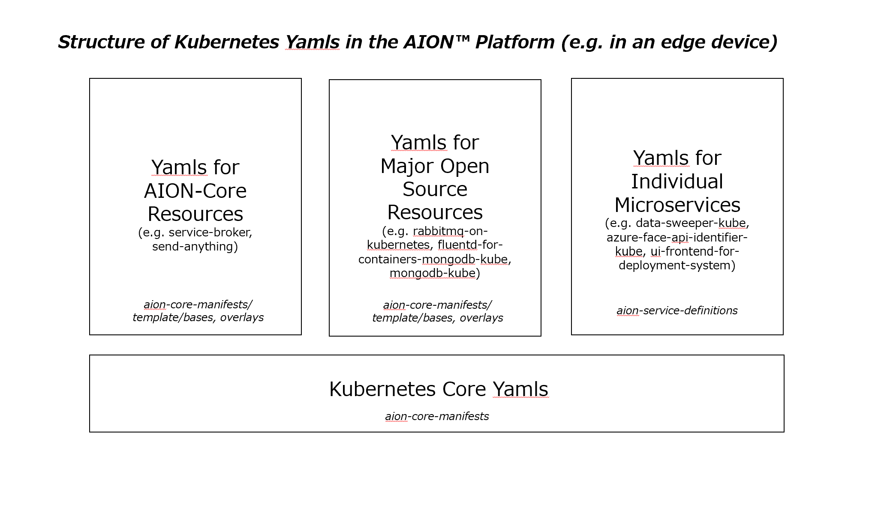

## **aion-service-definitions** 
aion-service-definitions は、aion-core 上で機能する特定のリソースをデプロイ、稼働を行うためのマニフェストファイルです。  

aion-coreについては[こちら](https://github.com/latonaio/aion-core)をご覧ください。  

### AION の Kubernetes Yaml ファイルの構造（エッジデバイス内） 
AIONプラットフォームのあるエッジデバイス内において、Kubernetes Yaml ファイルは、次の領域に分かれています。

* Kubernetes コアのYamlファイル  

* AION-Core のYamlファイル  

* 主要なオープンソースリソース のYamlファイル  

* 個別マイクロサービス  のYamlファイル  




### AION の Kubernetes Yaml ファイルの所在
それぞれの Yamlファイルは、以下のレポジトリにあります。  

* Kubernetes コアのYamlファイル  >>>  [aion-core-manifests](https://github.com/latonaio/aion-core-manifests)  

* AION-Core のYamlファイル  >>>  [aion-core-manifests](https://github.com/latonaio/aion-core-manifests)  

* 主要なオープンソースリソース のYamlファイル  >>>  [aion-core-manifests](https://github.com/latonaio/aion-core-manifests)

* 個別マイクロサービス  のYamlファイル    >>>  [aion-service-definitions](https://github.com/latonaio/aion-service-definitions)


## 前提条件  
[aion-coreのセットアップ](https://github.com/latonaio/aion-core)でaion-coreをセットアップします。  
[aion-core-manifests](https://github.com/latonaio/aion-core-manifests) では、aion-core および AION 関連リソースをまとめて、template>各サービスのymlファイル（⇒マニフェスト生成後のサンプルファイルとしては default.yml） に記載していますが、aion-service-definitions は、それらとは別に、services.yml へ特定のリソースを記載することで、プロジェクト固有のアプリケーション・システム・マイクロサービス等のデプロイ、稼働をさせることができます。  

## aion-service-definitionsで定義されたマイクロサービスの立ち上げ・稼働  
aion-service-definitionsのservices.ymlで定義されたマイクロサービスは、AION Core の Service Broker により立ち上げ・稼働が制御されます。  

[aion-core](https://github.com/latonaio/aion-core)のcmd>service-broker下のDockerfile-service-brokerに、本レポジトリに該当するマイクロサービスを読み込むためのコンフィグ設定が記載されています。  

```
CMD ["./service-broker", "-c", "config/services.yml"]
```

## services.ymlの書き方

### AION における 典型的な services.yml の書き方 ###
AION では、マイクロサービスのservices.ymlの典型的な書き方として、次のものがあります。  

* scale     ： Podを複数立てるときに、指定された個数までスケールします（"1"だとスケールしない設定になります）   

* startup   ： "yes"の場合、aion-core の service-broker 起動時に同時にPodを起動させます。AIONでは、Podは原則常時起動（="yes"）です。これは、エッジ端末において、常にPodがマイクロサービスとして待機状態であることを示します。AIONでは、原則として各マイクロサービスのPodを待機(もしくは稼働)状態にさせておいて、必要な場合に処理実行させる方式が採用されています。  

* always    ： Podが停止すると、常にPodを再起動させる機能です。初期値は全て"yes"になっています。   

* env       ： 環境変数を直接指定します。マイクロサービス固有の環境変数の例としては、接続先RabbitMQ環境の情報、接続先DB環境の情報、接続先デバイス名、認証鍵、その他のNW情報、が挙げられます。  

* privileged： Podを特権付きで動かすときに使用されます。  

* volumeMountPathList： 特定のマイクロサービスにおけるデータの永続化のために必要になります。書き方の例としては次の通りです。
```
  - /var/run/docker.sock:/var/run/docker.sock　":"より左側はPodのパスです。":"より右側はホスト側のパスです。
```

### services.yml の サンプル ###
本レポジトリには、services.ymlのサンプルとして、コンテナデプロイメントシステムのために必要なマイクロサービスの設定ファイルが含まれています。  
services.ymlの記述様式には、エッジアプリケーション・エッジシステムとして求められる固有の様式が、含まれます。  
本サンプルファイルにおいて、hera、irisはデバイスの名前、addrはエッジネットワーククラスター内におけるそれぞれのデバイスのIP、titaniadb-sentinelはマイクロサービスの名前です。
```
devices:
  hera:
    addr: xxx.xxx.xxx.xxx
    aionHome: /var/lib/aion
  iris:
    addr: xxx.xxx.xxx.xxx
    aionHome: /var/lib/aion
microservices:
  titaniadb-sentinel:
    scale: 1
    startup: yes
    always: yes
    env:
      MY_NODE_NAME: YOUR_DEVICE_NAME
```
